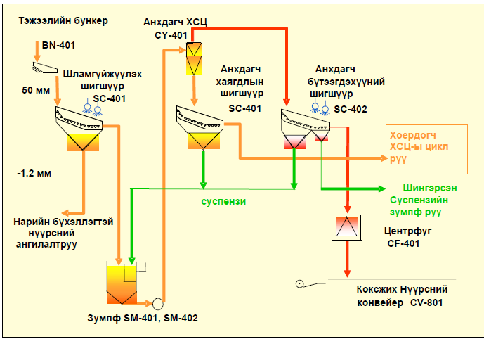
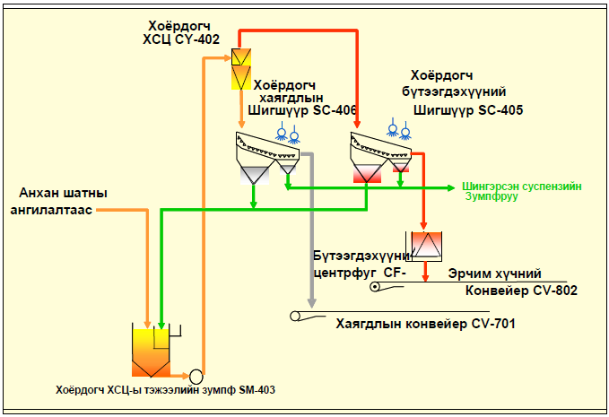
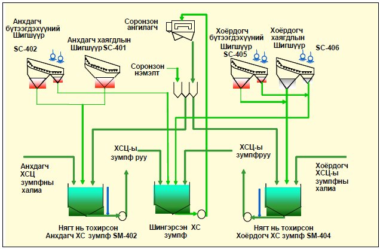
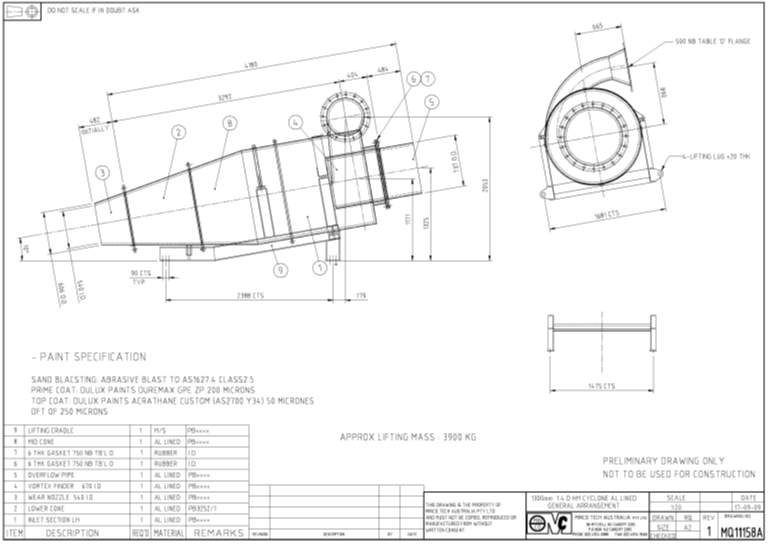
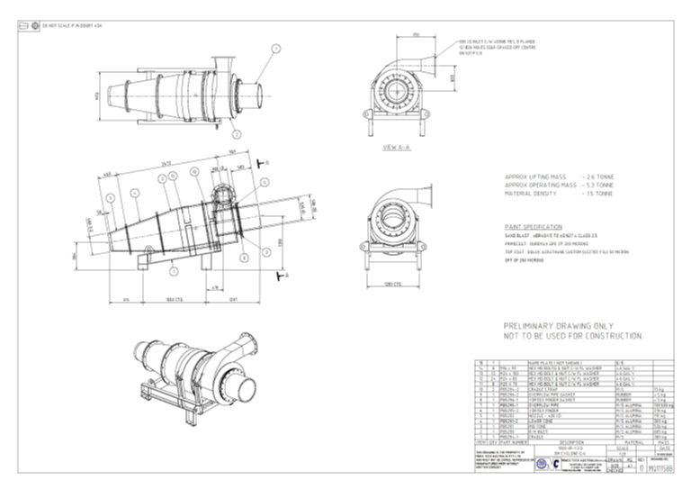

# Plant Profile — Үйлдвэрийн тохиргооны хуудас

**Хувилбар:** v0.2
**Огноо:** 2026-05-18
**Зохиогч:** Duk (үйлдвэрийн өгөгдөл) + AI зөвлөх (бүтэц)
**Эхний үйлдвэр:** Reference Plant A (лавлагаа үйлдвэр)

> **Энэ документ юу вэ.**
> Домэйн мэдлэгийн документ (Doc 02) нь **универсал** — физик, зарчим, аль ч DMC үйлдвэрт адил. Энэ документ (Doc 03) нь **үйлдвэр тус бүрт өөр** байх БҮХ зүйлийг агуулна: хүчин чадал, циклоны хэмжээ, feed rate, тоног төхөөрөмж, PLC tag.
>
> Шинэ үйлдвэрт программ суулгахдаа **зөвхөн энэ хуудсыг хувилж бөглөнө** — код өөрчлөхгүй. Цаашид энэ нь шууд программын **config файл** болж хувирна.
>
> **Тэмдэглэгээ:** `[DUK INPUT NEEDED]` — бөглөгдөөгүй; `[VERIFY]` — баталгаажуулах; `[CLARIFY]` — өгөгдсөн боловч утга нь тодорхойгүй

---

## Агуулга

1. Үйлдвэрийн таних мэдээлэл
2. Баяжуулалтын схем
3. Циклоны үзүүлэлт
4. Загварын масс баланс / feed rate
5. Ширхэглэлийн хүрээ
6. Орчны нягт ба ажиллах хязгаар
7. Магнетит
8. Орчны recovery систем
9. Насос
10. Хэмжих хэрэгсэл ба PLC tag
11. Бүтээгдэхүүний зорилт
12. Washability ба blend хийх практик
13. Тоног төхөөрөмжийн элэгдлийн baseline
14. Ажиллах горим
15. Нээлттэй зүйлс

---

## 1. Үйлдвэрийн таних мэдээлэл

| Талбар | Утга |
|--------|------|
| Үйлдвэрийн нэр | CHPP — Coarse circuit (лавлагаа нэр: "Reference Plant A") |
| Байршил | Өмнөговь |
| Эзэмшигч | MMC |
| Ашиглалтад орсон он | 2011 |
| Нэрлэсэн хүчин чадал | 900 t/h |
| Боловсруулдаг нүүрсний төрөл | Коксжих нүүрс (primary) + эрчим хүчний нүүрс (secondary) |

---

## 2. Баяжуулалтын схем

Reference Plant A нь **хоёр шатлалт DMC схем** — нэг ROM урсгалаас коксжих ба эрчим хүчний нүүрсийг дараалан салгана:

```
   ROM нүүрс (1.2–50 мм)
        │
        ▼
 ┌──────────────┐
 │ PRIMARY DMC  │  cut ~ коксжих нягт
 │  1300 мм     │
 └──────┬───────┘
        │
   ┌────┴─────────────┐
   ▼                  ▼
 Overflow           Underflow
 = КОКСЖИХ НҮҮРС    = secondary-ийн тэжээл
 (баяжмал)              │
                        ▼
                 ┌──────────────┐
                 │ SECONDARY DMC│  cut ~ эрчим хүчний нягт
                 │  1000 мм     │
                 └──────┬───────┘
                        │
                   ┌────┴──────┐
                   ▼           ▼
                Overflow    Underflow
                = ЭРЧИМ      = ХАЯГДАЛ
                  ХҮЧНИЙ        (refuse)
                  НҮҮРС
```

- **Primary DMC** — overflow нь коксжих нүүрсний баяжмал, underflow нь secondary руу
- **Secondary DMC** — overflow нь эрчим хүчний нүүрс, underflow нь эцсийн хаягдал
- Хоёулаа **two-product** циклон

`[DUK INPUT NEEDED]` Тус бүрт хэдэн циклон зэрэгцээ ажилладаг вэ? (модуль/блокийн тоо) Урьдчилсан desliming/screen, бутлуурын тоо?
, ,  энэ зураг дээр coarse coal circuit бүх тоног төхөөрөмжийн жагсаалт байгаа. Мөн зарчмын схем байгаа шүү.
---

## 3. Циклоны үзүүлэлт

| Үзүүлэлт | Primary DMC | Secondary DMC |
|----------|-------------|---------------|
| Зориулалт | Коксжих нүүрс | Эрчим хүчний нүүрс |
| Циклоны диаметр (D_c) | 1300 мм | 1000 мм |
| Vortex finder дотоод диаметр (D_o) | 670 мм | 535 мм |
| Spigot / apex дотоод диаметр (D_u) | 540 мм | 400 мм |
| D_o / D_c харьцаа | 0.52 `[ok]` | 0.54 `[ok]` |
| D_u / D_c харьцаа | 0.42 `[ok]` | 0.40 `[ok]` |
| Доторлогооны материал | Alumina | Alumina |
| Доторлогооны зузаан | 25 мм | 25 мм |
| Конусын өнцөг | 20 градус |

> `[CLARIFY]` **Геометрийн харьцааны тэмдэглэл.** Универсал жишгээр D_o/D_c нь ердийн 0.30–0.45, D_u/D_c нь 0.10–0.25 (Doc 02 §3.2-ыг үз). Reference Plant A-ийн тооцоолсон харьцаа эдгээрээс өндөр гарч байна. Энэ нь (а) DMC циклоны онцлог (нүүрсний DMC нь жижиг тоосонцрын циклоноос өөр геометртэй), эсвэл (б) хэмжээсийн нэр томъёоны зөрүү байж болзошгүй. Duk: эдгээр нь дотоод диаметр мөн үү, өгсөн утгууд зөв үү гэдгийг баталгаажуулна уу.
Онолын дагуу хийх нь зөв гэж бодож байна. 

---

## 4. Загварын масс баланс / feed rate

> **Тодруулсан (Duk).** Доорх хүснэгт дэх "Solids R.D." ба "Medium R.D." баганын утга:
>
> - **Solids R.D. (хатуугийн хувийн жин)** — циклонд орж буй цэвэр нүүрс ба дагалдах чулууны (solids) дундаж хувийн жин. Тэжээлийн нүүрсний шинжээс хамаарч ердийн үед **1.40–1.80 g/cm³**. Энэ нь хагалах (cut) нягт **БИШ**.
> - **Medium R.D. (орчны нягт)** — циклонд тууж оруулж буй магнетит зутангийн (зуурмагны) нягт. Баяжуулалтын технологийн горимоос хамаарч **1.30–1.60 g/cm³** (Primary-д арай бага, Secondary-д арай өндөр).

### 4.1 Циклон руу орох тэжээл (Feed)

| Урсгал | Primary DMC | Secondary DMC |
|--------|-------------|---------------|
| Хатуу биет (Solids), R.D. | 1.45 | 1.45 |
| Хатуу биет, t/h | 613 | 153 |
| Орчин (Medium), R.D. | 1.5 | 1.5 |
| Орчин, m³/h | 1971 | 1111 |
| Зутан (Slurry), m³/h | 2400 | 1200 |
- Ер нь бол primary cyclone-ий density gauge дээр уншигдаж байгаа нягт нь ихэнхдээ 1.3 - 1.36 хооронд л байдаг, Secondary cyclone-х 1.48 - 1.55 хавьцаа байдаг. cut point буюу ангилах нягт гэсэн үг тээ. 

### 4.2 Overflow (баяжмал тал)

| Урсгал | Primary DMC | Secondary DMC |
|--------|-------------|---------------|
| Хатуу биет, t/h | 460 | 38 |
| Хатуу биет, R.D. | `[DUK INPUT NEEDED]` | 1.5 | энд би яах ёстой билээ сайн ойлгохгүй байна.
| Орчин, R.D. | `[DUK INPUT NEEDED]` | 1.4 | энд би яах ёстой билээ сайн ойлгохгүй байна.
| Орчин, m³/h | 1385 | 1011 |

### 4.3 Underflow (хаягдал / дараагийн шатны тэжээл)

| Урсгал | Primary DMC | Secondary DMC |
|--------|-------------|---------------|
| Хатуу биет, t/h | 160 | 115 |
| Орчин, m³/h | 586 | 92 |

> **Балансын шалгалт (AI):** Primary: 460 + 160 = 620 ≈ 613 t/h ✓ (бөөрөнхийлөлт). Secondary: 38 + 115 = 153 t/h ✓. Primary underflow 160 t/h ≈ Secondary feed 153 t/h ✓ — схем зөв уялдаж байна.

---

## 5. Ширхэглэлийн хүрээ

| Талбар | Утга |
|--------|------|
| DMC-д орох нүүрсний ширхэг | 1.2 мм – 50 мм |
| Доод хязгаар (1.2 мм-ээс жижиг) | −1.2 +0.25 мм фракцыг **TBS (нарийн нүүрсний цикл)**, −0.25 мм фракцыг **флотаци (хэт нарийн нүүрсний цикл)** баяжуулна. | 
| Дээд хязгаар (50 мм-ээс том) | +50 мм хэмжээ нь 5%-иас ихгүй байх журамтай; дахин циклдэж буталдаггүй. | 

---

## 6. Орчны нягт ба ажиллах хязгаар

| Талбар | Утга |
|--------|------|
| Орчны (медиа) ажлын нягт — §1.1-д өгсөн | 1.30 – 1.35 g/cm³ |
| Циклоны тэжээлийн орчны R.D. — §4-д өгсөн | 1.5 |

> `[CLARIFY]` **Чухал тодруулга.** §1.1 нь медиа ажлын нягтыг 1.30–1.35 g/cm³ гэсэн, харин §4-ийн масс балансын хүснэгт циклоны тэжээлийн орчныг R.D. 1.5 гэсэн байна. Энэ хоёр өөр тоо. Магадгүй: 1.30–1.35 нь *хагалах нягт* (cut density), 1.5 нь *эргэлдэх/тэжээлийн орчны нягт* (circulating medium). Duk: аль нь юу болохыг, мөн Primary vs Secondary-д тус бүрт ямар утгатайг тодруулна уу. Энэ нь SP логикийн **гол оролт** тул маш чухал.

| Талбар | Утга |
|--------|------|
| Density-ийн ажиллах хязгаар (min/max) | `[DUK INPUT NEEDED]` |
| Density хэмжих арга | `[DUK INPUT NEEDED]` (γ-density gauge / U-tube / өөр) |

---

## 7. Магнетит

| Талбар | Утга |
|--------|------|
| Ширхэглэл | −0.045 мм (−45 µm) хэмжээтэй 90%+ |
| Хэрэглээ (consumption) | 600 г/тонн нүүрс |
| Магнитлаг чанар | `[DUK INPUT NEEDED]` (% магнитад татагдах) |
| Нийлүүлэгч / эх үүсвэр | `[DUK INPUT NEEDED]` |
| Үнэ ($/тонн) | `[DUK INPUT NEEDED]` |

> **Тэмдэглэл (AI):** Универсал жишгээр "минимум сайн" make-up нь 0.8–1.2 кг/т (Doc 02 §9.3). Reference Plant A нь 600 г/т = 0.6 кг/т — энэ нь жишгийн доод хязгаараас ч сайн. Энэ нь магнетитийн чанар, recovery систем сайн ажиллаж буйн дохио. `[VERIFY]` 600 г/т нь тогтмол үзүүлэлт мөн үү?

---

## 8. Орчны recovery систем

Reference Plant A-ийн орчин сэргээх дараалал:

- **Drain & rinse screen** — overflow / underflow дээр орчны магнетитийг усаар шүршиж цэвэрлэнэ. Шингэрсэн орчин зумпэнд цуглаж, magnetic separator руу шахагдана.
- **Magnetic separator** (drum, wet low-intensity) — магнетитийг ус-шавхайнаас буцаан барина. Баригдсан магнетит **Splitter box**-оор primary / secondary орчны зумпэнд **автоматаар** хуваарилагдана.
- **Density tank** — primary/secondary орчны нягт унавал splitter box-оор make-up хийнэ. Хуурай магнетитийг **усан буугаар оператор гараар** буудаж шингэлээд насосоор шахна.

`[DUK INPUT NEEDED]` Magnetic separator-ийн тоо, хэмжээ? Density tank-ийн make-up автомат уу, гар уу (одоо гар гэж ойлгож байна)?

---

## 9. Насос

| Талбар | Primary feed pump | Secondary feed pump |
|--------|-------------------|---------------------|
| Загвар / үйлдвэрлэгч | `[DUK INPUT NEEDED]` | `[DUK INPUT NEEDED]` |
| Моторын чадал (кВт) | `[DUK INPUT NEEDED]` | `[DUK INPUT NEEDED]` |
| Хурд хянах арга (VFD?) | `[DUK INPUT NEEDED]` | `[DUK INPUT NEEDED]` |
| Ажлын rpm хүрээ | `[DUK INPUT NEEDED]` | `[DUK INPUT NEEDED]` |

---

## 10. Хэмжих хэрэгсэл ба PLC tag

> Энэ хэсэг **хамгийн чухал** — программ ямар сигнал унших боломжтойг тодорхойлно. Жинхэнэ PLC tag-ийн жагсаалт орвол энэ нь Data Specification документын суурь болно.

| Хэмжигдэхүүн | Хэмжигддэг үү? | PLC tag нэр | Тэмдэглэл |
|--------------|-----------------|-------------|-----------|
| Орчны нягт (Primary) | `[DUK INPUT NEEDED]` | | |
| Орчны нягт (Secondary) | `[DUK INPUT NEEDED]` | | |
| Циклоны оролтын даралт (Primary) | `[DUK INPUT NEEDED]` | | |
| Циклоны оролтын даралт (Secondary) | `[DUK INPUT NEEDED]` | | |
| Тэжээлийн урсгал (flow) | `[DUK INPUT NEEDED]` | | |
| Насосны хурд (VFD %) | `[DUK INPUT NEEDED]` | | |
| Насосны моторын гүйдэл (A) | `[DUK INPUT NEEDED]` | | |
| Зумпны түвшин | `[DUK INPUT NEEDED]` | | |
| Magnetic separator гүйдэл | `[DUK INPUT NEEDED]` | | |
| Туузан жин (feed t/h) | `[DUK INPUT NEEDED]` | | |
| Online ash analyzer | `[DUK INPUT NEEDED]` | | байгаа эсэх |

`[DUK INPUT NEEDED]` PLC-ийн брэнд/загвар (Siemens, Allen-Bradley, өөр)? OPC UA сервер байгаа юу?

---

## 11. Бүтээгдэхүүний зорилт

| Бүтээгдэхүүн | Зорилтот ash% | Бусад спек | Гэрээний бүтэц |
|--------------|---------------|------------|-----------------|
| Коксжих нүүрс (primary overflow) | `[DUK INPUT NEEDED]` | `[DUK INPUT NEEDED]` (CSN, чийг, хүхэр г.м.) | `[DUK INPUT NEEDED]` |
| Эрчим хүчний нүүрс (secondary overflow) | `[DUK INPUT NEEDED]` | `[DUK INPUT NEEDED]` (илчлэг г.м.) | `[DUK INPUT NEEDED]` |

> Зорилтот ash-ыг **оператор гараар оруулна** (§14-ийг үз). Систем тэр ash дээр гарах хамгийн өндөр yield-ийг тооцоолно.

---

## 12. Washability ба blend хийх практик

Reference Plant A-ийн практик (Duk-ийн §5.2-оос):

- Washability-г **нүүрс тус бүрт нэг удаа**, тухайн нүүрс уурхайгаас олборлогдож эхлэх үед хийдэг (өдөр бүр биш).
- Давхрагуудын нүүрсийг **холиж тэжээдэг** тул blend-ийн тооцооллыг seam бүрийн washability үр дүнгээс нэгтгэж гаргадаг.
- Аль давхаргуудыг хольвол **ижил нягт дээр баяжигдаж**, нүүрсний авалт өндөр байхыг тооцоолж, гарцын төлөвлөгөөнд тусгадаг.
- Хэрэв тэжээлийн үнс washability-аас зөрвөл: үнс өсвөл өндөр нягттай хэсгийн хэмжээг нэмж, бага нягттай хэсгийг буулгаж тэжээлийн үнсийг "бариулж" дахин тооцоолдог.

> **Чухал ажиглалт (Duk).** Practice дээр washability-г шинээр боловсруулж тохиргоо хийхээс илүү, **өмнө нь яаж угаагдаж байсан түүхээ** харж setpoint тавих нь үр дүнтэй байдаг. → Энэ нь Doc 02 §5-д нэмэгдсэн **хоёр түвшний загвар**-ын үндэс (washability = теорийн хүрээ; угаалтын түүх = эмпирик залруулга / кейс сан).

`[DUK INPUT NEEDED]` Seam бүрийн washability хүснэгт олдвол энд хавсаргана — NDM (±0.1) болон cut-density тооцоог үүнээс гаргана.

---

## 13. Тоног төхөөрөмжийн элэгдлийн baseline

| Тоног төхөөрөмж | Жишиг ажиллах хугацаа | Эх сурвалж |
|-----------------|------------------------|------------|
| Vortex finder (Alumina) | `[DUK INPUT NEEDED]` (универсал жишиг 8,000–12,000 ц) | Reference Plant A-ийн бодит туршлага |
| Spigot / apex (Alumina) | `[DUK INPUT NEEDED]` (универсал жишиг 6,000–10,000 ц) | |
| Насосны impeller | `[DUK INPUT NEEDED]` (универсал жишиг 3,000–5,000 ц) | |
| Циклоны конусын доторлогоо | `[DUK INPUT NEEDED]` | |

---

## 14. Ажиллах горим

Reference Plant A нь **Ash-priority** горимоор ажилладаг (Duk-ийн §5.5-аас):

- Зорилтот ash нь тогтмол, **оператор гараар оруулна**.
- Систем тухайн ash дээр гарах **хамгийн өндөр yield**-ийг тооцоолж зөвлөнө.
- Нэмэлт шаардлага: blend хийсэн нүүрснүүд хоорондоо өөр нягт дээр баяжигддаг тул нэг cut point дээр ангилах боломжгүй, зарим нүүрс хаягдах нөхцөл үүсвэл **систем сануулга өгнө**.

---

## 15. Нээлттэй зүйлс (бөглөх ёстой)

Энэ профайлыг бүрэн болгоход дараах мэдээлэл шаардлагатай:

1. ✅ §1 — Үйлдвэрийн нэр, байршил, эзэмшигч, хүчин чадал — **бөглөгдсөн (v0.2)**
2. §3 — Геометрийн харьцаа `[CLARIFY]`, конусын өнцөг ,  за энэ циклоны хэмжээ болон бусад мэдээлэлтэй зураг шүү.
3. §6 — 1.30–1.35 g/cm³ vs §4-ийн 1.5 нягтын утгуудыг тулгах ("Solids R.D." / "Medium R.D." тодорхойлолт §4-т хийгдсэн ✅)
4. §9 — Насосны загвар, чадал, VFD
5. §10 — **PLC tag-ийн жагсаалт** (Data Spec-ийн суурь)
6. §11 — Бүтээгдэхүүний ash зорилт ба гэрээ
7. §12 — Seam бүрийн washability хүснэгт
8. §13 — Элэгдлийн бодит хугацаа

---

## 16. Хувилбарын түүх

| Хувилбар | Огноо | Өөрчлөлт |
|----------|-------|----------|
| v0.1 | 2026-05-18 | Анхны төсөл — бүтэц + Reference Plant A-ийн өгөгдөл (Duk-ийн Doc 02 засвараас гаргаж авав) |
| v0.2 | 2026-05-22 | §1 таних мэдээлэл, §5 ширхэглэлийн доод/дээд хязгаар бөглөгдсөн; §4 "Solids R.D." / "Medium R.D." тодорхойлолтыг Duk-ийн inline тайлбараас оруулж тодруулсан |

## 17. Гол ажиллах зарчим
- Би ер нь AI-г яаж ажиллуулах гээд байгаа вэ гэхээр Washability үр дүнгүүдийг нь оруулчихна. Тэгээд үйлдвэрийн бүх шаардлагатай тоног төхөөрөмжийн хэмжилтийг 7 хоног бүрийн зогсолтоор хэмждэг юм. Тэр хэмжилтийн утга болон washability үр дүнгээр Setpoint-уудыг санал болгодог болгомоор байгаа юм. Хэрэв тухайн blend урд нь явж байсан бол мөн Setpoint-уудыг санал болгохдоо хэмжилтийн утгыг харж байгаад өгдөг байх. Жишээ нь Dense medium циклоны Spigot нь элэгдсэн байвал тухайн элэгдсэн хэмжээ нь солих арай болоогүй байвал тухайн элэгдэлд нь тааруулаад насосны хурдыг жаахан нэмж даралтыг нь бариулдаг ч юм уу? эсвэл зумпны түвшинг өндөр барих ч байдаг юм уу? мөн элэгдэл нь ямар хугацааны дараа буюу хэдэн тн/цаг явсны дараа солих шаардлагатай гэдэг анхааруулга өгдөгч юм уу? энэ долоо хоногийн хэмжилтээр хошуугаа солиорой гэдэг мэдэгдэл ирдэг ч юм уу?
Washability, лабораторын 2 цаг тутмын тэжээлийн болон бүтээгдэхүүний дээжний үр дүн, үйлдвэрийн бүх циклийн 12 цагийн дээжний үр дүн, тоног төхөөрөмжийн хэмжилтийн гараар оруулсан утга, өмнө нь хэрхэн баяжигдаж байсан түүхэн дата зэрэг бүхий л мэдээллийг харж байгаад Setpoint санал болгодог AI ажилламаар байгаа юм.
Мөн засвар төлөвлөлтийн төлөвлөгөө гаргадаг байх гэхдээ үүнийг дараагийн хэсэгт хийнэ гэдгээрээ хойшлуулна шүү зүгээр мартаагүй байгаа дээрээ сануулж байгаа юм. 